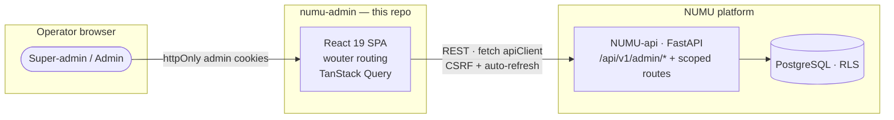

# NUMU Admin Backoffice

The internal **platform admin panel** for the NUMU e-commerce platform. Super-admins manage every merchant, order, and customer across the platform; scoped admins are limited to assigned merchants via RBAC.

A **pure Vite SPA** — React 19 client that talks directly to `NUMU-api` with cookie auth. There is no server in this repo.

> **Architecture note (Mar 2026):** the previous Express + tRPC + Drizzle server layer was removed (`refactor: remove Express/tRPC server layer`, commit `37d30e8`). If you find docs or plan files referencing `server/`, `drizzle/`, tRPC routers, or `numuDataLayer.ts` — they are stale; this repo is client-only.

---

## Table of contents

- [System context](#system-context)
- [Tech stack](#tech-stack)
- [API access](#api-access)
- [Auth & RBAC](#auth--rbac)
- [Pages](#pages)
- [Environment switcher](#environment-switcher)
- [Project structure](#project-structure)
- [Getting started](#getting-started)
- [Environment variables](#environment-variables)
- [Conventions](#conventions)

---

## System context



The admin app talks to `NUMU-api` like any other client. All admin-only data (assignments, platform config, marketplace review state) lives in NUMU-api's database — this repo has **no database of its own**.

---

## Tech stack

| Layer | Choice |
|-------|--------|
| Client framework | React 19 + TypeScript 5.9 |
| Build | Vite 7 |
| Styling | Tailwind CSS 4 · shadcn/ui · Radix |
| Routing | **wouter** (~3.3 kB — *not* react-router-dom) |
| Data fetching | TanStack React Query 5 + fetch `apiClient` |
| Animation | Framer Motion |
| Auth | httpOnly admin cookies + CSRF double-submit |
| Package manager | npm (`pnpm-workspace.yaml` is a leftover — ignore) |

---

## API access

Service modules in `client/src/services/` (authApi, adminApi, merchantService, orderService, customerService, emailTemplatesApi, marketplaceAdminApi, platformConfigApi, …) call a fetch-based `apiClient` that:

- sends `credentials: "include"` (httpOnly cookies),
- attaches the CSRF token on mutations and refreshes it on 403,
- auto-refreshes the session on 401 with single-flight deduplication,
- unwraps the `{data: T}` envelope.

> Known duplication: `client/src/services/api.ts` and `client/src/lib/apiClient.ts` are ~95% identical fetch wrappers (filed as B-13 — unify when convenient).

In dev, the Vite proxy renames cookies `access_token` → `admin_access_token` so a local merchant-hub session on another port doesn't collide.

---

## Auth & RBAC

```mermaid
sequenceDiagram
    actor U as Admin
    participant C as React SPA
    participant NUMU as NUMU-api

    U->>C: open /login
    C->>NUMU: POST /api/v1/admin/auth/login
    NUMU-->>C: Set-Cookie admin_access_token / admin_refresh_token (httpOnly)
    C->>NUMU: GET /auth/csrf-token → kept in JS memory
    C->>NUMU: subsequent requests (cookies + X-CSRF-Token)
    Note over NUMU: role ∈ {admin, super_admin} enforced server-side;<br/>admins are scoped to assigned merchants
```

| Role | Scope |
|------|-------|
| `super_admin` | sees *all* merchants & data, platform settings |
| `admin` | sees only assigned merchants |

---

## Pages

Routed with wouter in `client/src/App.tsx` (26 pages under `client/src/pages/`):

| Area | Routes |
|------|--------|
| Core | `/login` · `/` home · `/merchants` · `/orders` · `/customers` · `/analytics` |
| Money | `/billing` · `/reports` · `/reconciliation` |
| Platform | `/settings` · `/platform/settings` · `/landing-page` · `/beta-program` · `/pricing-plans` · `/merchant-hub-nav` |
| Comms | `/email-templates` · `/email-templates/:eventType/:language` |
| Themes & marketplace | `/themes` · `/marketplace/review` · `/marketplace/themes` · `/marketplace/themes/:slug` · `/marketplace/snapshots[/:storeId]` |

---

## Environment switcher

`client/src/lib/env.ts` provides a runtime switcher (prod / stage / test) so one deployed admin build can point at any NUMU environment. All service calls route through it.

---

## Project structure

```text
numu-admin/
├── client/
│   ├── public/               # NUMU brand favicon set
│   ├── index.html
│   └── src/
│       ├── pages/            # wouter-routed pages (incl. marketplace/, platform/)
│       ├── components/       # UI components (shadcn/ui)
│       ├── services/         # per-domain API modules
│       ├── _core/hooks/      # useAuth + helpers
│       ├── contexts/         # ThemeContext (light/dark)
│       └── lib/              # apiClient · env switcher · csrf · utils
├── components.json           # shadcn/ui registry
├── vite.config.ts            # dev server :5000 + /api proxy + cookie renaming
└── package.json
```

---

## Getting started

```bash
# 1. Install dependencies
npm install

# 2. Configure environment
cp .env.example .env          # set VITE_API_URL

# 3. Start the dev server (port 5000)
npm run dev

# 4. Build + preview
npm run build
npm run preview
```

For a fully local stack, run NUMU-api on `:8001` and set `VITE_API_URL=http://127.0.0.1:8001/api/v1` (NUMU-api CORS allows `:5000`/`:5001`).

---

## Environment variables

| Variable | Description |
|----------|-------------|
| `VITE_API_URL` | NUMU-api base URL incl. `/api/v1` (overrides the dev proxy) |

Runtime environment selection (prod/stage/test) is handled in-app via the env switcher — no rebuild needed.

---

## Conventions

- **wouter, not react-router.** Different API — read its docs before adding routes.
- **No zod layer** — backend Pydantic validates; `apiClient` surfaces `detail` messages as thrown `Error`s. Mirror Pydantic schemas with hand-written TS types in the service module.
- **Soft Minimalist design.** Warm off-white surfaces, soft shadows, indigo accents. Framer Motion for transitions.
- **All money in cents** — divide by 100 before display.
- **Path alias:** `@/` → `client/src/`.
